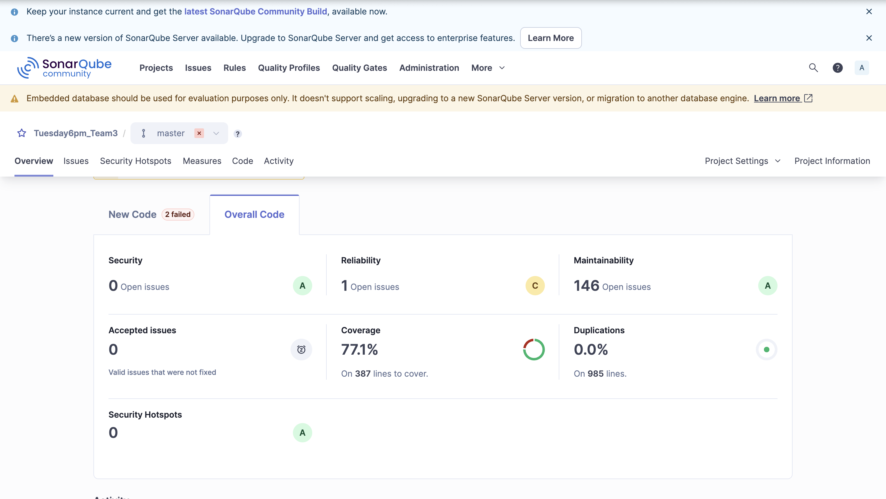
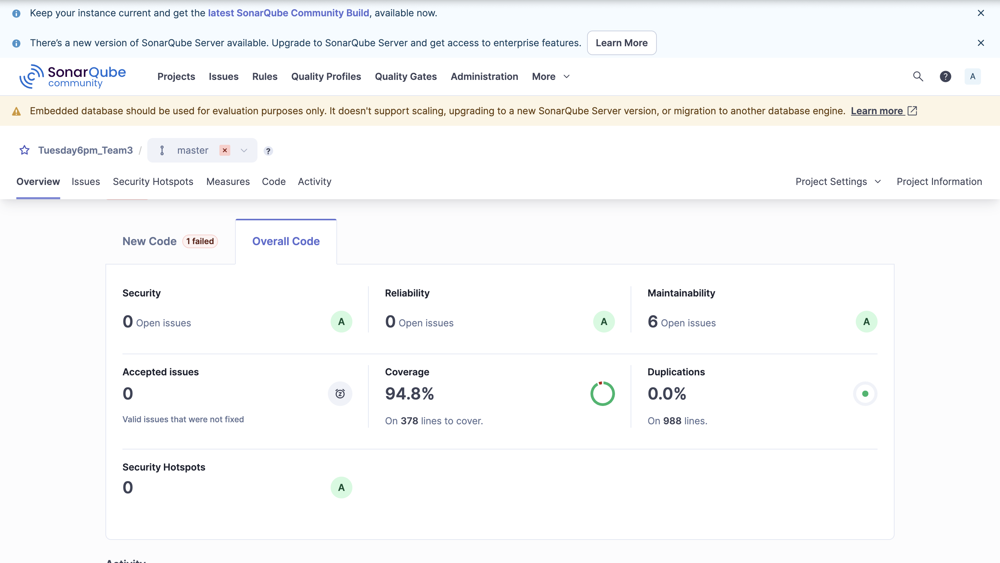

# Airline Reservation System — Test Automation Portfolio

**Coverage improved from 74% to 96% · 85+ JUnit test cases authored · 95% historical mutation score**

A Java test automation case study by **Vallabh Shelar**, developed with a three-person team for Monash University's FIT5171 project, March–June 2025. The work focused on finding coverage gaps, strengthening assertions, and verifying airline booking behavior through unit and integration tests.

**Java 21 · JUnit 5 · Mockito · Maven · JaCoCo · SonarQube · PIT**

[Quality report](docs/Software-Quality-Report.pdf) · [Test strategy and examples](docs/TESTING.md) · [Evidence and reproducibility](docs/EVIDENCE.md)

## Results at a glance

| Project outcome | Result |
| --- | --- |
| Code coverage improvement | **74% → 96%**, a 22 percentage-point increase |
| My contribution to the test suite | **85+ JUnit test cases** |
| Reliability defects identified | **15** |
| Historical PIT mutation score | **95%** |
| Current automated suite | **161 passing tests**, including unit and integration tests |

The historical achievements above follow my project summary and resume. The original report and screenshots capture additional measurements from the project and are preserved below. Fresh results for this source snapshot are recorded in [the verification record](docs/VERIFICATION.md).

## My contribution

As **Lead Developer & Tester**, I developed four Java components, resolved approximately 30 integration errors, and authored 85+ JUnit test cases across the project. My work included:

- Deploying SonarQube with Docker and integrating the team's codebases.
- Refactoring `Airplane`, `FlightCollection`, `Passenger`, and `TicketSystem` to improve testability and maintainability.
- Testing validation rules, boundary values, booking failures, and business/economy seat updates.
- Using static analysis and mutation testing to guide coverage improvements and stronger assertions.
- Maintaining requirements traceability and documenting integration work.

The Assessment 3 report credits me with 35 tests in that assessment. The 85+ figure describes my contribution across the broader project. Overall quality and mutation results are team outcomes; Xin Shi contributed quality engineering and refactoring, and Akash Kumar Singh owned PIT configuration and mutation analysis.

## Before and after: SonarQube

These original dashboard captures show **77.1% → 94.8% overall coverage**, alongside fewer maintainability and reliability issues.

| Dashboard metric | Before | After |
| --- | ---: | ---: |
| Overall coverage | 77.1% | 94.8% |
| Maintainability issues | 146 | 6 |
| Reliability issues | 1 | 0 |
| Duplicated code | 0.0% | 0.0% |

### Before



### After



The dashboard's overall coverage is distinct from the report's line and condition coverage. The after screenshot still shows one failed new-code check. See [evidence notes](docs/EVIDENCE.md) for the measurements and their sources.

## How the tests improved confidence

1. **Locate gaps:** review SonarQube and JaCoCo results for untested branches and validation paths.
2. **Add focused cases:** cover invalid inputs, seat limits, age-based pricing, missing flights, and already-booked tickets.
3. **Test interactions:** verify complete booking scenarios across passengers, tickets, flights, and aircraft.
4. **Challenge assertions:** use PIT to change production bytecode and identify tests that fail to detect changed behavior.
5. **Prevent regressions:** run the suite with explicit coverage thresholds and retain readable reports.

The suite demonstrates parameterized testing, grouped assertions, Mockito static mocking, boundary-value testing, and integration testing. [Explore representative tests and the test map.](docs/TESTING.md)

## Run locally

Requirements: **JDK 21** and **Maven 3.9+**. No application server, database, Docker, or SonarQube instance is needed to run the tests.

```bash
# Run all 161 tests, generate coverage reports, and enforce coverage thresholds.
mvn --batch-mode --no-transfer-progress clean verify

# Run PIT mutation analysis and enforce its threshold.
mvn --batch-mode --no-transfer-progress test-compile org.pitest:pitest-maven:mutationCoverage
```

Open `target/site/jacoco/index.html` for coverage and `target/pit-reports/index.html` for mutation results. JUnit XML results are under `target/surefire-reports/`.

## Automation and quality gates

The portfolio includes a [GitHub Actions workflow](.github/workflows/quality.yml) configured for pushes and pull requests, plus a manual trigger. It runs Java 21 tests and PIT in separate jobs and uploads their reports, including when a job fails. The workflow is prepared locally; a hosted run is only established after the repository is pushed.

| Check | Minimum |
| --- | ---: |
| JaCoCo line coverage | 95% |
| JaCoCo branch coverage | 90% |
| PIT mutation score | 90% |

These are executable Maven checks added during portfolio preparation. The original `.gitlab-ci.yml` is retained as historical project material. SonarQube dashboard analysis is documented in the report; the new workflow uses JaCoCo and PIT without requiring a SonarQube server or credentials.

## Project layout

```text
src/main/java/com/ars/unit/         Airline reservation domain and booking logic
src/test/java/com/ars/unit/         Eight unit test classes
src/test/java/com/ars/Integration/  Five integration test classes
docs/                             Report, screenshots, strategy, and evidence
.github/workflows/quality.yml      Test, coverage, and mutation automation
pom.xml                           Dependencies, reporting, and quality thresholds
```

This is an academic, in-memory reservation system. It demonstrates Java test automation and quality improvement; mobile UI, HTTP API, accessibility, and load testing belong to other portfolio projects.
